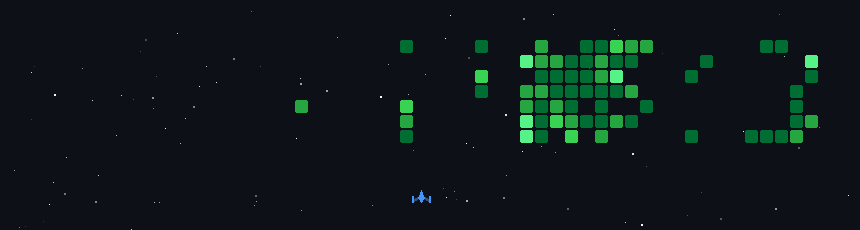

# 💫 About Me:
## Hi there, I'm THARANITHARAN S 👋

### Full Stack Developer and ML Engineer with hands-on experience building end-to-end systems, from responsive frontend interfaces to AI-powered backend solutions. Skilled in developing scalable web applications, integrating machine learning models, and designing clean, efficient architectures.

- 🚀 Currently building full-stack and ML-based systems that solve real-world problems
- 🧠 Learning by shipping projects, breaking things, and improving them
- 🛠 Ask me about React, backend systems, and machine learning integration
- 📬 Reach me at:  [LinkedIn](https://www.linkedin.com/in/tharanitharan-s/)
- ⚙️ Fun fact: Turned a simple idea into an ML-based solution just to explore its potential

  

## 🌐 Socials:

 
 

## 💻 Tech Stack

<!-- 🌐 Frontend -->

 

<!-- 📱 Mobile Development -->

 <!-- React Native -->

 

<!-- ⚙️ Backend -->

 

<!-- 🗄️ Database -->

 

<!-- 🤖 AI / Computer Vision -->

 

<!-- 💻 Programming Languages -->

 

<!-- 🛠️ Tools & Version Control -->

 

 

